# Supervised Learning
## Project: Finding Donors for CharityML
<style>
  #my-chart {
    font-family: Arial, sans-serif;
    font-size: 16px;
  }
</style>
### Install

This project requires **Python 3.x** and the following Python libraries installed:

- [NumPy](http://www.numpy.org/)
- [Pandas](http://pandas.pydata.org)
- [matplotlib](http://matplotlib.org/)
- [scikit-learn](http://scikit-learn.org/stable/)

You will also need to have software installed to run and execute an [iPython Notebook](http://ipython.org/notebook.html)

We recommend students install [Anaconda](https://www.continuum.io/downloads), a pre-packaged Python distribution that contains all of the necessary libraries and software for this project.

### Code

Template code is provided in the `finding_donors.ipynb` notebook file. You will also be required to use the included `visuals.py` Python file and the `census.csv` dataset file to complete your work. While some code has already been implemented to get you started, you will need to implement additional functionality when requested to successfully complete the project. Note that the code included in `visuals.py` is meant to be used out-of-the-box and not intended for students to manipulate. If you are interested in how the visualizations are created in the notebook, please feel free to explore this Python file.

### Run

In a terminal or command window, navigate to the top-level project directory `finding_donors/` (that contains this README) and run one of the following commands:

```bash
ipython notebook finding_donors.ipynb
```  
or
```bash
jupyter notebook finding_donors.ipynb
```

This will open the iPython Notebook software and project file in your browser.

### Data

The modified census dataset consists of approximately 32,000 data points, with each datapoint having 13 features. This dataset is a modified version of the dataset published in the paper *"Scaling Up the Accuracy of Naive-Bayes Classifiers: a Decision-Tree Hybrid",* by Ron Kohavi. You may find this paper [online](https://www.aaai.org/Papers/KDD/1996/KDD96-033.pdf), with the original dataset hosted on [UCI](https://archive.ics.uci.edu/ml/datasets/Census+Income).

**Features**
- `age`: Age
- `workclass`: Working Class (Private, Self-emp-not-inc, Self-emp-inc, Federal-gov, Local-gov, State-gov, Without-pay, Never-worked)
- `education_level`: Level of Education (Bachelors, Some-college, 11th, HS-grad, Prof-school, Assoc-acdm, Assoc-voc, 9th, 7th-8th, 12th, Masters, 1st-4th, 10th, Doctorate, 5th-6th, Preschool)
- `education-num`: Number of educational years completed
- `marital-status`: Marital status (Married-civ-spouse, Divorced, Never-married, Separated, Widowed, Married-spouse-absent, Married-AF-spouse)
- `occupation`: Work Occupation (Tech-support, Craft-repair, Other-service, Sales, Exec-managerial, Prof-specialty, Handlers-cleaners, Machine-op-inspct, Adm-clerical, Farming-fishing, Transport-moving, Priv-house-serv, Protective-serv, Armed-Forces)
- `relationship`: Relationship Status (Wife, Own-child, Husband, Not-in-family, Other-relative, Unmarried)
- `race`: Race (White, Asian-Pac-Islander, Amer-Indian-Eskimo, Other, Black)
- `sex`: Sex (Female, Male)
- `capital-gain`: Monetary Capital Gains
- `capital-loss`: Monetary Capital Losses
- `hours-per-week`: Average Hours Per Week Worked
- `native-country`: Native Country (United-States, Cambodia, England, Puerto-Rico, Canada, Germany, Outlying-US(Guam-USVI-etc), India, Japan, Greece, South, China, Cuba, Iran, Honduras, Philippines, Italy, Poland, Jamaica, Vietnam, Mexico, Portugal, Ireland, France, Dominican-Republic, Laos, Ecuador, Taiwan, Haiti, Columbia, Hungary, Guatemala, Nicaragua, Scotland, Thailand, Yugoslavia, El-Salvador, Trinadad&Tobago, Peru, Hong, Holand-Netherlands)

**Target Variable**
- `income`: Income Class (<=50K, >50K)

```mermaid
    graph TD;
id45(Burj Khalifa Construction)-->id1(Plan and Design)
id45(Burj Khalifa Construction)-->id4(Pour Concrete Floors)
id45(Burj Khalifa Construction)-->id5(Install Cladding)
id45(Burj Khalifa Construction)-->id6(Install Building Systems)
id45(Burj Khalifa Construction)-->id7(Complete Interior Fit-Out)
id45(Burj Khalifa Construction)-->id8(Final Inspection and Handover)
id1(Plan and Design)-->id2(Build Foundation);
id2(Build Foundation)-->id9(Site Preparation);
id9(Site Preparation)-->id10(Clear Site);
id9(Site Preparation)-->id11(Excavate Foundation);
id9(Site Preparation)-->id12(Install Utilities);
id2(Build Foundation)-->id13(Pile Installation);
id13(Pile Installation)-->id14(Drill Holes for Piles);
id13(Pile Installation)-->id15(Insert Steel Reinforcement);
id13(Pile Installation)-->id16(Pour Concrete);
id2(Build Foundation)-->id17(Build Raft);
id17(Build Raft)-->id18(Install Formwork);
id17(Build Raft)-->id19(Pour Concrete);
id2(Build Foundation)-->id20(Build Diaphragm Walls);
id20(Build Diaphragm Walls)-->id21(Excavate Trench);
id20(Build Diaphragm Walls)-->id22(Install Formwork);
id20(Build Diaphragm Walls)-->id23(Pour Concrete);
id2(Build Foundation)-->id3(Erect Steel Frame);
id3(Erect Steel Frame)-->id24(Fabricate Steel Sections);
id3(Erect Steel Frame)-->id25(Transport Steel Sections to Site);
id3(Erect Steel Frame)-->id26(Install Steel Beams and Columns);
id4(Pour Concrete Floors)-->id27(Fabricate Reinforcement Bars);
id4(Pour Concrete Floors)-->id28(Install Formwork);
id4(Pour Concrete Floors)-->id29(Pour Concrete);
id4(Pour Concrete Floors)-->id30(Install MEP Systems);
id5(Install Cladding)-->id31(Fabricate Cladding Panels);
id5(Install Cladding)-->id32(Transport Cladding Panels to Site);
id5(Install Cladding)-->id33(Install Cladding Panels);
id6(Install Building Systems)-->id34(Install MEP Systems);
id6(Install Building Systems)-->id35(Install Elevators);
id6(Install Building Systems)-->id36(Install Plumbing);
id6(Install Building Systems)-->id37(Install Electrical Systems);
id7(Complete Interior Fit-Out)-->id38(Install Interior Walls);
id7(Complete Interior Fit-Out)-->id39(Install Flooring);
id7(Complete Interior Fit-Out)-->id40(Install Fixtures and Fittings);
id7(Complete Interior Fit-Out)-->id41(Paint and Decorate);
id8(Final Inspection and Handover)-->id42(Conduct Final Inspection);
id8(Final Inspection and Handover)-->id43(Obtain Occupancy Permit);
id8(Final Inspection and Handover)-->id44(Hand Over Building);
```


```mermaid
    graph TD;
id1(Project Initiation)--> id2(Establish Project Objectives);
id1(Project Initiation)--> id3(Define Project Scope);
id1(Project Initiation)--> id4(Identify Stakeholders);
id1(Project Initiation)--> id5(Conduct Feasibility Studies);
id1(Project Initiation)--> id6(Obtain Approvals);
id1(Project Initiation)--> id7(Secure Project Funding);

id5(Conduct Feasibility Studies)-->id8(Analyse Site);
id5(Conduct Feasibility Studies)-->id9(Identify Potential Risks);

id3(Define Project Scope)-->id10(Determine Requirements);
id3(Define Project Scope)-->id11(Define Deliverables);
id3(Define Project Scope)-->id12(Define Objectives);

id10(Determine Requirements)-->id13(Identify Building Codes);
id10(Determine Requirements)-->id14(Identify Environmental Standards);
id10(Determine Requirements)-->id15(Identify Permit Requirements);

id11(Define Deliverables)-->id16(Develop Conceptual Design);
id11(Define Deliverables)-->id17(Prepare Schematic Design);
id11(Define Deliverables)-->id18(Develop Detailed Design);

id16(Develop Conceptual Design)-->id19(Conduct Site Analysis);
id16(Develop Conceptual Design)-->id20(Develop Project Requirements);

id17(Prepare Schematic Design)-->id21(Review and Approve Design);
id17(Prepare Schematic Design)-->id22(Develop Construction Drawings);

id18(Develop Detailed Design)-->id23(Develop Technical Specifications);

id6(Obtain Approvals)-->id24(Identify Required Approvals);
id6(Obtain Approvals)-->id25(Prepare Approval Applications);
id6(Obtain Approvals)-->id26(Submit Approval Applications);

id7(Secure Project Funding)-->id27(Identify Required Funding);
id7(Secure Project Funding)-->id28(Develop Funding Plan);
id7(Secure Project Funding)-->id29(Solicit Funding);

id27(Identify Required Funding)-->id30(Estimate Project Costs);
id27(Identify Required Funding)-->id31(Identify Potential Funding Sources);
id27(Identify Required Funding)-->id32(Determine Funding Requirements);

id29(Solicit Funding)-->id33(Present Project Proposal);
id29(Solicit Funding)-->id34(Negotiate Funding Terms);

id33(Present Project Proposal)-->id35(Obtain Funding);

id24(Identify Required Approvals)-->id36(Identify Regulatory Bodies);
id24(Identify Required Approvals)-->id37(Identify Approval Requirements);

id26(Submit Approval Applications)-->id38(Obtain Required Approvals);

id13(Identify Building Codes)-->id39(Review Building Codes);

id14(Identify Environmental Standards)-->id40(Review Environmental Standards);

id15(Identify Permit Requirements)-->id41(Identify Permitting Agencies);
id15(Identify Permit Requirements)-->id42(Identify Permitting Requirements);

id19(Conduct Site Analysis)-->id43(Conduct Topographical Surveys);


